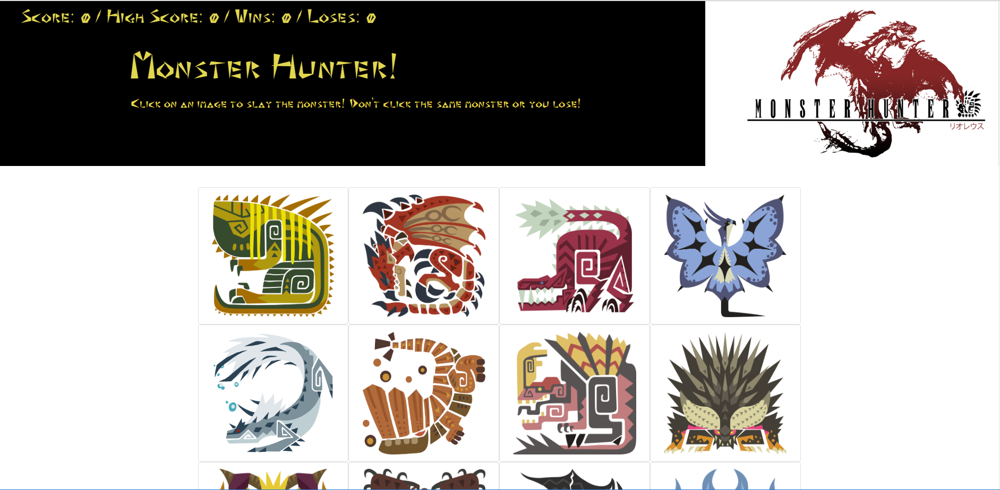

This project was bootstrapped with [Create React App](https://github.com/facebook/create-react-app).

## Clicky Game (Monster Hunter Themed)



[Link to the Github Repo!](https://github.com/DarrylJLTolentino/ClickyGame)

[Link to the Github Pages](https://darryljltolentino.github.io/ClickyGame/)

## Description

This website features a React Application that is a memory in which you must click all twelve monster images without any duplicates. The components for the react page consists of a fixed nav, a hero, the game space, and monster cards. The fixed nav contains the score, high score, wins and losses and when the user scrolls down to play the game, the nav follows the window.

```js
function Nav(props) {
    return (
        <div>
            <ul className="nav fixed-top">
                <li className = "nav-item">
                    <p className = "score">Score: {props.score} / High Score: {props.high_score} / Wins: {props.wins} / Loses: {props.loses}</p>
                </li>
            </ul>
        </div>
    );
}
```

The hero component contains a title "Monster Hunter" as well as dynamically changing text and images. 

```js
function Hero(props) {
    const heroImage = {
        backgroundImage: `url("${props.src}")`,
        backgroundSize: "auto 100%",
        backgroundPosition: "right",
        backgroundRepeat: "no-repeat",
        backgroundColor: "black"
    }

    console.log(props.src);

    return (
        <div>
            <div style={heroImage} className="jumbotron jumbotron-fluid">
                <div className="container text-left">
                    <h1 className="display-4">Monster Hunter!</h1>
                    <p className="lead">{props.name}</p>
                </div>
            </div>
        </div>
    );
}
```

The game space is a container component where all the monster card components are located.

```js
function GameSpace(props) {
    return (
        <div className = "container justify-content-center" style = {styles.gamespace} >
            {props.children}
        </div>
    );
}
```

The monster cards consist of a a card div that has an event listener and an image of the monster icons from Monster Hunter.

```js
function Card(props) {
    return (
        <div className="monsterCard card" onClick = {() => props.click(props.id)}>
            
        </div>
    );
}
```

The App.js in the src directory is where all the logic is. I imported Component from react here in order to make App a class, which is stateful.

```js
class App extends Component {

  state = {
    score: 0,
    high_score: 0,
    wins: 0,
    loses: 0,
    monsters: monsters,
    currentMonster: {},
    lossImage: "",
    slainMessage: ""
  };
```

When the user loses the game, the game resets and all states are reset except for high score, wins, and loses.

```js
reset = () => {
    //this will iterate through monsters and reset all the 'clicked' to 'false'
    this.state.monsters.forEach((monster) => (
      monster.clicked = false
    ));
    this.setState({
      score: 0,
      currentMonster: {},
      lossImage: "https://www.nicepng.com/png/full/183-1836148_guild-stamp-of-disapproval-monster-hunter-world-quest.png",
      slainMessage: ""
    });
  };
```

In order to shuffle the cards around, there is a sort function that can be called within the class that can be accessed in order to shuffle when necessary.
```js
sort = () => {
    this.state.monsters.sort(() => Math.random() - 0.70);
  }
```

The game logic is inside the handleClick function that takes an id, sets currentMonster to that monster, checks if the monster has been clicked. If it hasn't, then it is set to true and score increases by one. If score is greater than high score then both increase by 1. User will also see text that tells them that they slayed a monster. If the user loses, hero displays Quest Failed and the game resets and losses increases by 1. If the user gets 12 points, they win and will see a Quest Complete image, the game resets and wins increases by 1.
```js
handleClick = id => {

    const foundMonster = this.state.monsters.find((monster) => monster.id === id);
    console.log(foundMonster);
    this.setState({ currentMonster: foundMonster })
    if (foundMonster.clicked === false) {
      foundMonster.clicked = true;
      this.sort();
      if (this.state.score + 1 > this.state.high_score) {
        if (this.state.score + 1 === 12) {
          foundMonster.heroImage = "https://res.cloudinary.com/lmn/image/upload/e_sharpen:150,f_auto,fl_lossy,q_80/v1/gameskinnyc/q/u/e/quest-clear-redbubble-682ed.jpg";
          this.setState({
            currentMonster: foundMonster,
            wins: this.state.wins + 1,
            lossImage: ""
          });
        }
        this.setState({
          score: this.state.score + 1,
          high_score: this.state.high_score + 1,
          slainMessage: `You have slain the mighty ${foundMonster.name}! Choose another monster to slay!`
        });
      }
      else {
        this.setState({
          score: this.state.score + 1,
          slainMessage: `You have slain the mighty ${foundMonster.name}! Choose another monster to slay!`
        });
      }
    }
    else {
      this.setState({
        currentMonster: foundMonster,
        loses: this.state.loses + 1,
        slainMessage: "You can't slay the same monster twice! Try again"
      })
      this.sort();
      this.reset();
    }
  }
```

The game is rendered in render() where it returns the nav, hero, gamespace, cards and footer components to app.js, which then renders to index.js. Then index.js renders to the dom in index.html.
```js
render() {
    return (
      <div>
        <Nav score={this.state.score} high_score={this.state.high_score} wins = {this.state.wins} loses = {this.state.loses} />
        <Hero src={this.state.currentMonster.heroImage || this.state.lossImage || "https://i.redd.it/diihdl111ln01.png"} name = {this.state.slainMessage || "Click on an image to slay the monster! Don't click the same monster or you lose!"} />
        <GameSpace>
          {this.state.monsters.map((monster) => (
            <MonsterCard
              id={monster.id}
              key={monster.id}
              name={monster.name}
              image={monster.image}
              click={this.handleClick}
            />
          ))}
        </GameSpace>
        <Footer />
      </div>
    );
  }
}
```